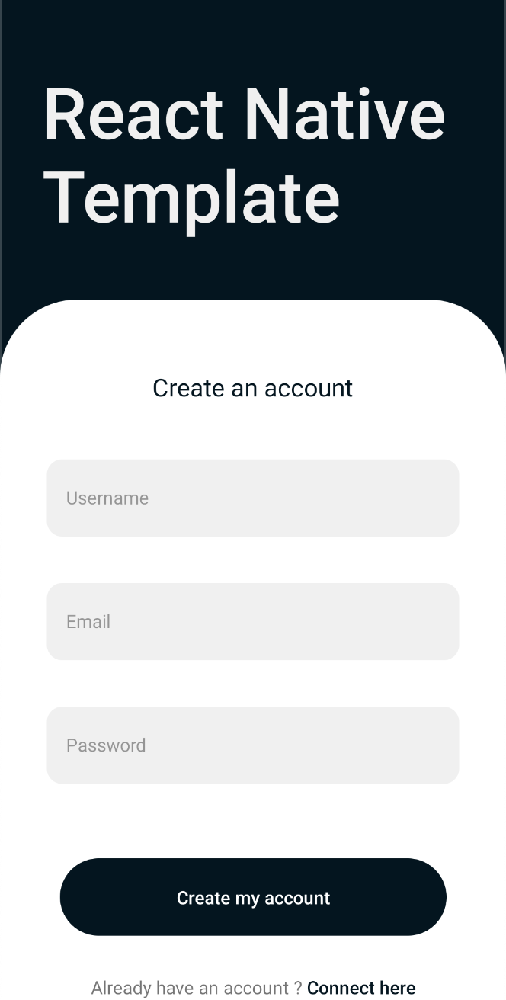
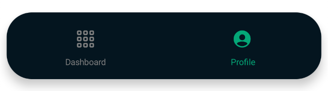

# 📱 React / React native Starter Kit

### Features

> #### 🌐 Authentication
>> 👥 _Login and register to server_

   
   

> #### Navigation 

   
  

## Libraries used

> 💻 Web app

#### Node

- **_Bootstrap [4.3.1]_**
- **_JQuery [3.6.0]_**
- **_React [16.10.2]_**

> 📱 Android / Ios

#### Android

- Gradle

#### Node

- **_react-navigation/bottom-tabs [6.1.0]_**
- **_react-navigation/native [6.0.7]_**
- **_react-native-screens [3.10.2]_**
- **_react-native-webview [11.17.1]_**
- **_react-navigation [4.4.4]_**
- **_react [17.0.2]_**
- **_react-native [0.67.1]_**
